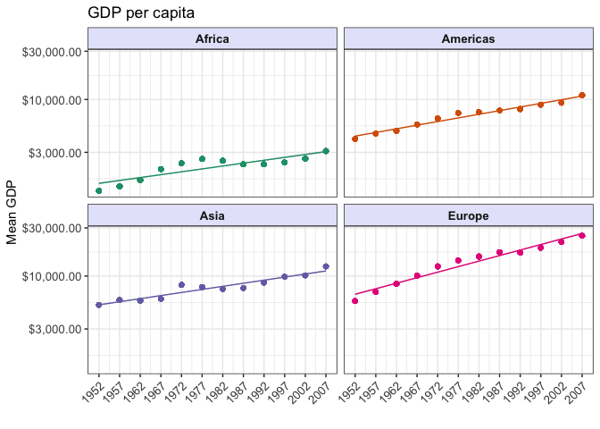
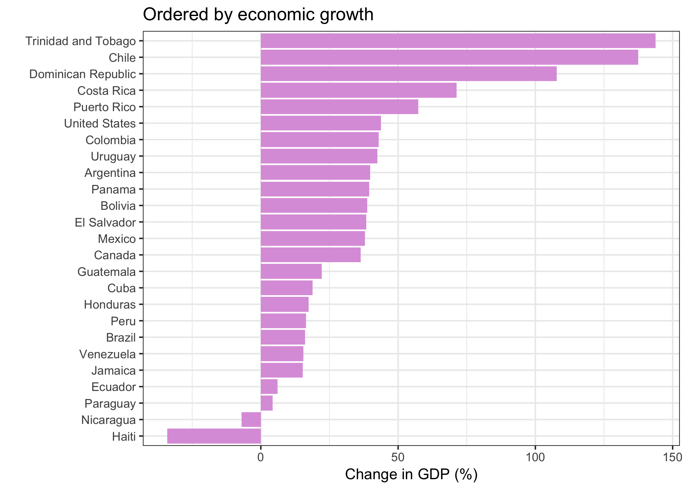

hw05\_factor\_figure\_mgmt
================
Alejandra
17/10/2018

## Factor and figure management

This is an R Markdown document elaborated to serve as a personal
cheatsheet on the topic of factor and figure management. For the
exercises contained in this assignment, I chose to work with the
`gapminder` dataset.

## Loading data and required libraries

``` r
library(gapminder)
library(tidyverse)
library(plotly)
library(knitr)
library(kableExtra)
library(gridExtra)
library(scales)
```

## Part 1: Factor management

*Factor inspection*

First, let’s ensure the variables that I’ll explore are factors. This
can be done by looking at the class of the variables.

``` r
# showing str() output as a table
data.frame(variable = names(gapminder),
           class = sapply(gapminder, class),
           levels = sapply(gapminder, nlevels),
           first_values = sapply(gapminder, function(x) paste0(head(x),  collapse = ", ")),
           row.names = NULL) %>%
  kable() %>%
  kable_styling(full_width = F, position = "center")
```

<table class="table" style="width: auto !important; margin-left: auto; margin-right: auto;">

<thead>

<tr>

<th style="text-align:left;">

variable

</th>

<th style="text-align:left;">

class

</th>

<th style="text-align:right;">

levels

</th>

<th style="text-align:left;">

first\_values

</th>

</tr>

</thead>

<tbody>

<tr>

<td style="text-align:left;">

country

</td>

<td style="text-align:left;">

factor

</td>

<td style="text-align:right;">

142

</td>

<td style="text-align:left;">

Afghanistan, Afghanistan, Afghanistan, Afghanistan, Afghanistan,
Afghanistan

</td>

</tr>

<tr>

<td style="text-align:left;">

continent

</td>

<td style="text-align:left;">

factor

</td>

<td style="text-align:right;">

5

</td>

<td style="text-align:left;">

Asia, Asia, Asia, Asia, Asia, Asia

</td>

</tr>

<tr>

<td style="text-align:left;">

year

</td>

<td style="text-align:left;">

integer

</td>

<td style="text-align:right;">

0

</td>

<td style="text-align:left;">

1952, 1957, 1962, 1967, 1972, 1977

</td>

</tr>

<tr>

<td style="text-align:left;">

lifeExp

</td>

<td style="text-align:left;">

numeric

</td>

<td style="text-align:right;">

0

</td>

<td style="text-align:left;">

28.801, 30.332, 31.997, 34.02, 36.088, 38.438

</td>

</tr>

<tr>

<td style="text-align:left;">

pop

</td>

<td style="text-align:left;">

integer

</td>

<td style="text-align:right;">

0

</td>

<td style="text-align:left;">

8425333, 9240934, 10267083, 11537966, 13079460, 14880372

</td>

</tr>

<tr>

<td style="text-align:left;">

gdpPercap

</td>

<td style="text-align:left;">

numeric

</td>

<td style="text-align:right;">

0

</td>

<td style="text-align:left;">

779.4453145, 820.8530296, 853.10071, 836.1971382, 739.9811058, 786.11336

</td>

</tr>

</tbody>

</table>

In the table above we can see the classes of all variables. The
variables `country` and `continent` are indeed factors, `country` has
142 levels and `continent` has 5 levels.

**Explore the effects of `arrange()`**

Does merely arranging the data have any effect on a figure?

Here, I’ll explore what happens to a figure after sorting the data with
the `arrange()` function. I’ll order the `continent` variable according
to the minimum value of life expectancy.

First let’s check that `arrange()` works:

``` r
#new dataset with continent and minimum lifeExp
gap_minlifeExp <- gapminder %>% 
  group_by(continent) %>%
  summarize(minlife = min(lifeExp)) %>%
  arrange(minlife)

kable(gap_minlifeExp) %>%
  kable_styling(full_width = F)
```

<table class="table" style="width: auto !important; margin-left: auto; margin-right: auto;">

<thead>

<tr>

<th style="text-align:left;">

continent

</th>

<th style="text-align:right;">

minlife

</th>

</tr>

</thead>

<tbody>

<tr>

<td style="text-align:left;">

Africa

</td>

<td style="text-align:right;">

23.599

</td>

</tr>

<tr>

<td style="text-align:left;">

Asia

</td>

<td style="text-align:right;">

28.801

</td>

</tr>

<tr>

<td style="text-align:left;">

Americas

</td>

<td style="text-align:right;">

37.579

</td>

</tr>

<tr>

<td style="text-align:left;">

Europe

</td>

<td style="text-align:right;">

43.585

</td>

</tr>

<tr>

<td style="text-align:left;">

Oceania

</td>

<td style="text-align:right;">

69.120

</td>

</tr>

</tbody>

</table>

We can see that the data in the table was indeed arranged by the minimum
value of life expectancy in each continent in ascending order.

Now let’s try arranging the data in a figure. For the purposes of
plotting, I will join the dataset `gap_minlifeExp` created above with
the `gapminder` dataset and arrange the data using `minlife` as
before.

``` r
gap_new <- left_join(gapminder, gap_minlifeExp, by = "continent") #join datasets to create a boxplot


gap_new %>% 
  arrange(minlife) %>% 
  ggplot(aes(x = continent, y = lifeExp, fill = continent)) +
  scale_fill_brewer(palette = "Pastel2") + #change color palette
  guides(fill=FALSE) + #remove unnecessary color legend
  geom_boxplot() +
  labs(x = "Continent", y = "Life Expectancy") +
  theme_bw() #select theme
```

<!-- -->

As we can see, in the figure the data wasn’t arranged as it was in the
output table, instead, continents are sorted alphabetically.

**Explore the effects of reordering a factor**

What effect does this have on a figure?

Here I will try to sort the data of the same figure but using
`reorder()` instead.

``` r
p0 <- gap_new %>%
  ggplot(aes(x = reorder(continent, minlife), y = lifeExp, fill = continent)) +
  scale_fill_brewer(palette = "Pastel2") + #change color palette
  guides(fill=FALSE) + #remove unnecessary color legend
  geom_boxplot() +
  labs(x = "Continent", y = "Life Expectancy") +
  theme_bw() #select theme
p0
```

<!-- -->

As the `reorder()` function does reorders the levels of the factor, the
continents in the figure are now ordered as desired (by minimum life
expectancy).

### Drop Oceania

In this section, I’ll flter the `gpminder` data to remove observations
associated with the continent of Oceania. Additionally, remove unused
factor levels. Provide concrete information on the data before and after
removing these rows and Oceania; address the number of rows and the
levels of the affected factors.

``` r
gap_no_oceania <- gapminder %>%
  filter(continent != "Oceania")

str(gap_no_oceania)
```

    ## Classes 'tbl_df', 'tbl' and 'data.frame':    1680 obs. of  6 variables:
    ##  $ country  : Factor w/ 142 levels "Afghanistan",..: 1 1 1 1 1 1 1 1 1 1 ...
    ##  $ continent: Factor w/ 5 levels "Africa","Americas",..: 3 3 3 3 3 3 3 3 3 3 ...
    ##  $ year     : int  1952 1957 1962 1967 1972 1977 1982 1987 1992 1997 ...
    ##  $ lifeExp  : num  28.8 30.3 32 34 36.1 ...
    ##  $ pop      : int  8425333 9240934 10267083 11537966 13079460 14880372 12881816 13867957 16317921 22227415 ...
    ##  $ gdpPercap: num  779 821 853 836 740 ...

Looking at the structure, we can see that the number of observations in
`gap_no_oceania` is different from the original `gapminder` dataset:
1680 vs. 1704 respectiveley, however the number of levels in both
`country` and `continent` is still the same.

Let’s look at the unique values in `gap_no_oceania`

``` r
summary(gap_no_oceania$continent)
```

    ##   Africa Americas     Asia   Europe  Oceania 
    ##      624      300      396      360        0

We can see that the observations from Oceania were removed but is still
in the factor levels.

Let’s remove Oceania from the levels:

``` r
gap_no_oceania <- droplevels(gap_no_oceania)
nlevels(gap_no_oceania$continent) #check the number of levels
```

    ## [1] 4

``` r
summary(gap_no_oceania$continent) #check which are the remaining levels 
```

    ##   Africa Americas     Asia   Europe 
    ##      624      300      396      360

As noted, we are now left with 4 levels. The Oceania level was removed
by using `droplevels()`, this function drops unused levels from a
factor, since Oceania didn’t have observations anymore it was dropped.

### Reorder the levels of `continent`

Here, I will use the `forcats` package to change the order of the factor
levels, based on the change in % of GDP per capita. I’m interested in
looking at the change in GDP in countries of the Americas from the last
20 years of data (1987-2007)

First let’s calculate the % change in this period:

``` r
gap_gdp <- gapminder %>%
  filter(continent == "Americas", year %in% c(1987, 2007)) %>%
  select(country, year, gdpPercap) %>%
  spread(key = year, value = gdpPercap) %>%
  mutate(growth = (`2007` - `1987`)/`1987`*100) %>% #calculate percentage of change
  arrange(growth)

kable(gap_gdp) %>%
  kable_styling(full_width = F)
```

<table class="table" style="width: auto !important; margin-left: auto; margin-right: auto;">

<thead>

<tr>

<th style="text-align:left;">

country

</th>

<th style="text-align:right;">

1987

</th>

<th style="text-align:right;">

2007

</th>

<th style="text-align:right;">

growth

</th>

</tr>

</thead>

<tbody>

<tr>

<td style="text-align:left;">

Haiti

</td>

<td style="text-align:right;">

1823.016

</td>

<td style="text-align:right;">

1201.637

</td>

<td style="text-align:right;">

\-34.085211

</td>

</tr>

<tr>

<td style="text-align:left;">

Nicaragua

</td>

<td style="text-align:right;">

2955.984

</td>

<td style="text-align:right;">

2749.321

</td>

<td style="text-align:right;">

\-6.991357

</td>

</tr>

<tr>

<td style="text-align:left;">

Paraguay

</td>

<td style="text-align:right;">

3998.876

</td>

<td style="text-align:right;">

4172.838

</td>

<td style="text-align:right;">

4.350292

</td>

</tr>

<tr>

<td style="text-align:left;">

Ecuador

</td>

<td style="text-align:right;">

6481.777

</td>

<td style="text-align:right;">

6873.262

</td>

<td style="text-align:right;">

6.039784

</td>

</tr>

<tr>

<td style="text-align:left;">

Jamaica

</td>

<td style="text-align:right;">

6351.237

</td>

<td style="text-align:right;">

7320.880

</td>

<td style="text-align:right;">

15.266990

</td>

</tr>

<tr>

<td style="text-align:left;">

Venezuela

</td>

<td style="text-align:right;">

9883.585

</td>

<td style="text-align:right;">

11415.806

</td>

<td style="text-align:right;">

15.502686

</td>

</tr>

<tr>

<td style="text-align:left;">

Brazil

</td>

<td style="text-align:right;">

7807.096

</td>

<td style="text-align:right;">

9065.801

</td>

<td style="text-align:right;">

16.122577

</td>

</tr>

<tr>

<td style="text-align:left;">

Peru

</td>

<td style="text-align:right;">

6360.943

</td>

<td style="text-align:right;">

7408.906

</td>

<td style="text-align:right;">

16.474948

</td>

</tr>

<tr>

<td style="text-align:left;">

Honduras

</td>

<td style="text-align:right;">

3023.097

</td>

<td style="text-align:right;">

3548.331

</td>

<td style="text-align:right;">

17.374044

</td>

</tr>

<tr>

<td style="text-align:left;">

Cuba

</td>

<td style="text-align:right;">

7532.925

</td>

<td style="text-align:right;">

8948.103

</td>

<td style="text-align:right;">

18.786570

</td>

</tr>

<tr>

<td style="text-align:left;">

Guatemala

</td>

<td style="text-align:right;">

4246.486

</td>

<td style="text-align:right;">

5186.050

</td>

<td style="text-align:right;">

22.125683

</td>

</tr>

<tr>

<td style="text-align:left;">

Canada

</td>

<td style="text-align:right;">

26626.515

</td>

<td style="text-align:right;">

36319.235

</td>

<td style="text-align:right;">

36.402511

</td>

</tr>

<tr>

<td style="text-align:left;">

Mexico

</td>

<td style="text-align:right;">

8688.156

</td>

<td style="text-align:right;">

11977.575

</td>

<td style="text-align:right;">

37.860956

</td>

</tr>

<tr>

<td style="text-align:left;">

El Salvador

</td>

<td style="text-align:right;">

4140.442

</td>

<td style="text-align:right;">

5728.354

</td>

<td style="text-align:right;">

38.351253

</td>

</tr>

<tr>

<td style="text-align:left;">

Bolivia

</td>

<td style="text-align:right;">

2753.691

</td>

<td style="text-align:right;">

3822.137

</td>

<td style="text-align:right;">

38.800483

</td>

</tr>

<tr>

<td style="text-align:left;">

Panama

</td>

<td style="text-align:right;">

7034.779

</td>

<td style="text-align:right;">

9809.186

</td>

<td style="text-align:right;">

39.438430

</td>

</tr>

<tr>

<td style="text-align:left;">

Argentina

</td>

<td style="text-align:right;">

9139.671

</td>

<td style="text-align:right;">

12779.380

</td>

<td style="text-align:right;">

39.823185

</td>

</tr>

<tr>

<td style="text-align:left;">

Uruguay

</td>

<td style="text-align:right;">

7452.399

</td>

<td style="text-align:right;">

10611.463

</td>

<td style="text-align:right;">

42.389894

</td>

</tr>

<tr>

<td style="text-align:left;">

Colombia

</td>

<td style="text-align:right;">

4903.219

</td>

<td style="text-align:right;">

7006.580

</td>

<td style="text-align:right;">

42.897559

</td>

</tr>

<tr>

<td style="text-align:left;">

United States

</td>

<td style="text-align:right;">

29884.350

</td>

<td style="text-align:right;">

42951.653

</td>

<td style="text-align:right;">

43.726240

</td>

</tr>

<tr>

<td style="text-align:left;">

Puerto Rico

</td>

<td style="text-align:right;">

12281.342

</td>

<td style="text-align:right;">

19328.709

</td>

<td style="text-align:right;">

57.382712

</td>

</tr>

<tr>

<td style="text-align:left;">

Costa Rica

</td>

<td style="text-align:right;">

5629.915

</td>

<td style="text-align:right;">

9645.061

</td>

<td style="text-align:right;">

71.318055

</td>

</tr>

<tr>

<td style="text-align:left;">

Dominican Republic

</td>

<td style="text-align:right;">

2899.842

</td>

<td style="text-align:right;">

6025.375

</td>

<td style="text-align:right;">

107.782851

</td>

</tr>

<tr>

<td style="text-align:left;">

Chile

</td>

<td style="text-align:right;">

5547.064

</td>

<td style="text-align:right;">

13171.639

</td>

<td style="text-align:right;">

137.452451

</td>

</tr>

<tr>

<td style="text-align:left;">

Trinidad and Tobago

</td>

<td style="text-align:right;">

7388.598

</td>

<td style="text-align:right;">

18008.509

</td>

<td style="text-align:right;">

143.733787

</td>

</tr>

</tbody>

</table>

As we can see, the continents were arranged by the growth in GDP, but
let’s remember that it doesn’t change the order of levels. I will use
`fct_reorder` to make my plot look nicer and compare with ploting
without reordering.

``` r
p1 <- ggplot(gap_gdp, aes(x = country, y = growth)) +
  geom_bar(stat = 'identity', fill = "plum") +
  coord_flip() +
  theme_bw()+
  labs(x = "", y = "Change in GDP (%)", title = "GDP growth in the Americas, 1987-2007")
p2 <- ggplot(gap_gdp, aes(x = fct_reorder(country, growth), y = growth )) +
  geom_bar(stat = 'identity', fill = "plum") +
  coord_flip() +
  theme_bw()+
  labs(x = "", y = "Change in GDP (%)", title = "Ordered by economic growth")
  
grid.arrange(p1, p2, nrow = 1)
```

<!-- -->

### Part 2: File I/O

#### `write_csv()`

First, I’ll check again that levels are saved

``` r
class(gap_gdp$country)  # corroborate that it is factor
```

    ## [1] "factor"

``` r
gap_gdp <- gap_gdp %>%
            mutate(country = fct_reorder(country, growth)) # Change factor levels to non-alphabetical

levels(gap_gdp$country) # corroborate reordering
```

    ##   [1] "Haiti"                    "Nicaragua"               
    ##   [3] "Paraguay"                 "Ecuador"                 
    ##   [5] "Jamaica"                  "Venezuela"               
    ##   [7] "Brazil"                   "Peru"                    
    ##   [9] "Honduras"                 "Cuba"                    
    ##  [11] "Guatemala"                "Canada"                  
    ##  [13] "Mexico"                   "El Salvador"             
    ##  [15] "Bolivia"                  "Panama"                  
    ##  [17] "Argentina"                "Uruguay"                 
    ##  [19] "Colombia"                 "United States"           
    ##  [21] "Puerto Rico"              "Costa Rica"              
    ##  [23] "Dominican Republic"       "Chile"                   
    ##  [25] "Trinidad and Tobago"      "Afghanistan"             
    ##  [27] "Albania"                  "Algeria"                 
    ##  [29] "Angola"                   "Australia"               
    ##  [31] "Austria"                  "Bahrain"                 
    ##  [33] "Bangladesh"               "Belgium"                 
    ##  [35] "Benin"                    "Bosnia and Herzegovina"  
    ##  [37] "Botswana"                 "Bulgaria"                
    ##  [39] "Burkina Faso"             "Burundi"                 
    ##  [41] "Cambodia"                 "Cameroon"                
    ##  [43] "Central African Republic" "Chad"                    
    ##  [45] "China"                    "Comoros"                 
    ##  [47] "Congo, Dem. Rep."         "Congo, Rep."             
    ##  [49] "Cote d'Ivoire"            "Croatia"                 
    ##  [51] "Czech Republic"           "Denmark"                 
    ##  [53] "Djibouti"                 "Egypt"                   
    ##  [55] "Equatorial Guinea"        "Eritrea"                 
    ##  [57] "Ethiopia"                 "Finland"                 
    ##  [59] "France"                   "Gabon"                   
    ##  [61] "Gambia"                   "Germany"                 
    ##  [63] "Ghana"                    "Greece"                  
    ##  [65] "Guinea"                   "Guinea-Bissau"           
    ##  [67] "Hong Kong, China"         "Hungary"                 
    ##  [69] "Iceland"                  "India"                   
    ##  [71] "Indonesia"                "Iran"                    
    ##  [73] "Iraq"                     "Ireland"                 
    ##  [75] "Israel"                   "Italy"                   
    ##  [77] "Japan"                    "Jordan"                  
    ##  [79] "Kenya"                    "Korea, Dem. Rep."        
    ##  [81] "Korea, Rep."              "Kuwait"                  
    ##  [83] "Lebanon"                  "Lesotho"                 
    ##  [85] "Liberia"                  "Libya"                   
    ##  [87] "Madagascar"               "Malawi"                  
    ##  [89] "Malaysia"                 "Mali"                    
    ##  [91] "Mauritania"               "Mauritius"               
    ##  [93] "Mongolia"                 "Montenegro"              
    ##  [95] "Morocco"                  "Mozambique"              
    ##  [97] "Myanmar"                  "Namibia"                 
    ##  [99] "Nepal"                    "Netherlands"             
    ## [101] "New Zealand"              "Niger"                   
    ## [103] "Nigeria"                  "Norway"                  
    ## [105] "Oman"                     "Pakistan"                
    ## [107] "Philippines"              "Poland"                  
    ## [109] "Portugal"                 "Reunion"                 
    ## [111] "Romania"                  "Rwanda"                  
    ## [113] "Sao Tome and Principe"    "Saudi Arabia"            
    ## [115] "Senegal"                  "Serbia"                  
    ## [117] "Sierra Leone"             "Singapore"               
    ## [119] "Slovak Republic"          "Slovenia"                
    ## [121] "Somalia"                  "South Africa"            
    ## [123] "Spain"                    "Sri Lanka"               
    ## [125] "Sudan"                    "Swaziland"               
    ## [127] "Sweden"                   "Switzerland"             
    ## [129] "Syria"                    "Taiwan"                  
    ## [131] "Tanzania"                 "Thailand"                
    ## [133] "Togo"                     "Tunisia"                 
    ## [135] "Turkey"                   "Uganda"                  
    ## [137] "United Kingdom"           "Vietnam"                 
    ## [139] "West Bank and Gaza"       "Yemen, Rep."             
    ## [141] "Zambia"                   "Zimbabwe"

``` r
# Save the dataframe into a csv file
write_csv(gap_gdp, "hw05_factor_figure_mgmt_files/gap_gdp.csv")
```

#### `read_csv()`

``` r
# Read in the data frame
gap_growth_new <- read_csv(file = "hw05_factor_figure_mgmt_files/gap_gdp.csv", col_names = TRUE)
```

    ## Parsed with column specification:
    ## cols(
    ##   country = col_character(),
    ##   `1987` = col_double(),
    ##   `2007` = col_double(),
    ##   growth = col_double()
    ## )

``` r
levels(gap_growth_new$country)
```

    ## NULL

``` r
gap_growth_new
```

    ## # A tibble: 25 x 4
    ##    country   `1987` `2007` growth
    ##    <chr>      <dbl>  <dbl>  <dbl>
    ##  1 Haiti      1823.  1202. -34.1 
    ##  2 Nicaragua  2956.  2749.  -6.99
    ##  3 Paraguay   3999.  4173.   4.35
    ##  4 Ecuador    6482.  6873.   6.04
    ##  5 Jamaica    6351.  7321.  15.3 
    ##  6 Venezuela  9884. 11416.  15.5 
    ##  7 Brazil     7807.  9066.  16.1 
    ##  8 Peru       6361.  7409.  16.5 
    ##  9 Honduras   3023.  3548.  17.4 
    ## 10 Cuba       7533.  8948.  18.8 
    ## # ... with 15 more rows

``` r
class(gap_growth_new$country)  # check class
```

    ## [1] "character"

The dataframe before generating the csv file considered `country` as a
factor. After opening the same file, the `country` variable is
considered as character.

#### `saveRDS()`

Now lets try with
`saveRDS`

``` r
saveRDS(gap_gdp, "hw05_factor_figure_mgmt_files/gap_gdp_factor.rds")
```

#### `readRDS()`

``` r
gap_growth_rds <- readRDS("hw05_factor_figure_mgmt_files/gap_gdp_factor.rds")
levels(gap_growth_rds$country)
```

    ##   [1] "Haiti"                    "Nicaragua"               
    ##   [3] "Paraguay"                 "Ecuador"                 
    ##   [5] "Jamaica"                  "Venezuela"               
    ##   [7] "Brazil"                   "Peru"                    
    ##   [9] "Honduras"                 "Cuba"                    
    ##  [11] "Guatemala"                "Canada"                  
    ##  [13] "Mexico"                   "El Salvador"             
    ##  [15] "Bolivia"                  "Panama"                  
    ##  [17] "Argentina"                "Uruguay"                 
    ##  [19] "Colombia"                 "United States"           
    ##  [21] "Puerto Rico"              "Costa Rica"              
    ##  [23] "Dominican Republic"       "Chile"                   
    ##  [25] "Trinidad and Tobago"      "Afghanistan"             
    ##  [27] "Albania"                  "Algeria"                 
    ##  [29] "Angola"                   "Australia"               
    ##  [31] "Austria"                  "Bahrain"                 
    ##  [33] "Bangladesh"               "Belgium"                 
    ##  [35] "Benin"                    "Bosnia and Herzegovina"  
    ##  [37] "Botswana"                 "Bulgaria"                
    ##  [39] "Burkina Faso"             "Burundi"                 
    ##  [41] "Cambodia"                 "Cameroon"                
    ##  [43] "Central African Republic" "Chad"                    
    ##  [45] "China"                    "Comoros"                 
    ##  [47] "Congo, Dem. Rep."         "Congo, Rep."             
    ##  [49] "Cote d'Ivoire"            "Croatia"                 
    ##  [51] "Czech Republic"           "Denmark"                 
    ##  [53] "Djibouti"                 "Egypt"                   
    ##  [55] "Equatorial Guinea"        "Eritrea"                 
    ##  [57] "Ethiopia"                 "Finland"                 
    ##  [59] "France"                   "Gabon"                   
    ##  [61] "Gambia"                   "Germany"                 
    ##  [63] "Ghana"                    "Greece"                  
    ##  [65] "Guinea"                   "Guinea-Bissau"           
    ##  [67] "Hong Kong, China"         "Hungary"                 
    ##  [69] "Iceland"                  "India"                   
    ##  [71] "Indonesia"                "Iran"                    
    ##  [73] "Iraq"                     "Ireland"                 
    ##  [75] "Israel"                   "Italy"                   
    ##  [77] "Japan"                    "Jordan"                  
    ##  [79] "Kenya"                    "Korea, Dem. Rep."        
    ##  [81] "Korea, Rep."              "Kuwait"                  
    ##  [83] "Lebanon"                  "Lesotho"                 
    ##  [85] "Liberia"                  "Libya"                   
    ##  [87] "Madagascar"               "Malawi"                  
    ##  [89] "Malaysia"                 "Mali"                    
    ##  [91] "Mauritania"               "Mauritius"               
    ##  [93] "Mongolia"                 "Montenegro"              
    ##  [95] "Morocco"                  "Mozambique"              
    ##  [97] "Myanmar"                  "Namibia"                 
    ##  [99] "Nepal"                    "Netherlands"             
    ## [101] "New Zealand"              "Niger"                   
    ## [103] "Nigeria"                  "Norway"                  
    ## [105] "Oman"                     "Pakistan"                
    ## [107] "Philippines"              "Poland"                  
    ## [109] "Portugal"                 "Reunion"                 
    ## [111] "Romania"                  "Rwanda"                  
    ## [113] "Sao Tome and Principe"    "Saudi Arabia"            
    ## [115] "Senegal"                  "Serbia"                  
    ## [117] "Sierra Leone"             "Singapore"               
    ## [119] "Slovak Republic"          "Slovenia"                
    ## [121] "Somalia"                  "South Africa"            
    ## [123] "Spain"                    "Sri Lanka"               
    ## [125] "Sudan"                    "Swaziland"               
    ## [127] "Sweden"                   "Switzerland"             
    ## [129] "Syria"                    "Taiwan"                  
    ## [131] "Tanzania"                 "Thailand"                
    ## [133] "Togo"                     "Tunisia"                 
    ## [135] "Turkey"                   "Uganda"                  
    ## [137] "United Kingdom"           "Vietnam"                 
    ## [139] "West Bank and Gaza"       "Yemen, Rep."             
    ## [141] "Zambia"                   "Zimbabwe"

``` r
class(gap_growth_rds$country)
```

    ## [1] "factor"

We can see that `saveRDS()` and `readRDS()` conserve the datatypes when
saving and reading an rds
file.

#### `dput()`

``` r
dput(gap_gdp, "hw05_factor_figure_mgmt_files/gap_gdp_factor.txt")
```

#### `dget()`

``` r
gap_growth_dget <- dget("hw05_factor_figure_mgmt_files/gap_gdp_factor.txt")
levels(gap_growth_dget$country)
```

    ##   [1] "Haiti"                    "Nicaragua"               
    ##   [3] "Paraguay"                 "Ecuador"                 
    ##   [5] "Jamaica"                  "Venezuela"               
    ##   [7] "Brazil"                   "Peru"                    
    ##   [9] "Honduras"                 "Cuba"                    
    ##  [11] "Guatemala"                "Canada"                  
    ##  [13] "Mexico"                   "El Salvador"             
    ##  [15] "Bolivia"                  "Panama"                  
    ##  [17] "Argentina"                "Uruguay"                 
    ##  [19] "Colombia"                 "United States"           
    ##  [21] "Puerto Rico"              "Costa Rica"              
    ##  [23] "Dominican Republic"       "Chile"                   
    ##  [25] "Trinidad and Tobago"      "Afghanistan"             
    ##  [27] "Albania"                  "Algeria"                 
    ##  [29] "Angola"                   "Australia"               
    ##  [31] "Austria"                  "Bahrain"                 
    ##  [33] "Bangladesh"               "Belgium"                 
    ##  [35] "Benin"                    "Bosnia and Herzegovina"  
    ##  [37] "Botswana"                 "Bulgaria"                
    ##  [39] "Burkina Faso"             "Burundi"                 
    ##  [41] "Cambodia"                 "Cameroon"                
    ##  [43] "Central African Republic" "Chad"                    
    ##  [45] "China"                    "Comoros"                 
    ##  [47] "Congo, Dem. Rep."         "Congo, Rep."             
    ##  [49] "Cote d'Ivoire"            "Croatia"                 
    ##  [51] "Czech Republic"           "Denmark"                 
    ##  [53] "Djibouti"                 "Egypt"                   
    ##  [55] "Equatorial Guinea"        "Eritrea"                 
    ##  [57] "Ethiopia"                 "Finland"                 
    ##  [59] "France"                   "Gabon"                   
    ##  [61] "Gambia"                   "Germany"                 
    ##  [63] "Ghana"                    "Greece"                  
    ##  [65] "Guinea"                   "Guinea-Bissau"           
    ##  [67] "Hong Kong, China"         "Hungary"                 
    ##  [69] "Iceland"                  "India"                   
    ##  [71] "Indonesia"                "Iran"                    
    ##  [73] "Iraq"                     "Ireland"                 
    ##  [75] "Israel"                   "Italy"                   
    ##  [77] "Japan"                    "Jordan"                  
    ##  [79] "Kenya"                    "Korea, Dem. Rep."        
    ##  [81] "Korea, Rep."              "Kuwait"                  
    ##  [83] "Lebanon"                  "Lesotho"                 
    ##  [85] "Liberia"                  "Libya"                   
    ##  [87] "Madagascar"               "Malawi"                  
    ##  [89] "Malaysia"                 "Mali"                    
    ##  [91] "Mauritania"               "Mauritius"               
    ##  [93] "Mongolia"                 "Montenegro"              
    ##  [95] "Morocco"                  "Mozambique"              
    ##  [97] "Myanmar"                  "Namibia"                 
    ##  [99] "Nepal"                    "Netherlands"             
    ## [101] "New Zealand"              "Niger"                   
    ## [103] "Nigeria"                  "Norway"                  
    ## [105] "Oman"                     "Pakistan"                
    ## [107] "Philippines"              "Poland"                  
    ## [109] "Portugal"                 "Reunion"                 
    ## [111] "Romania"                  "Rwanda"                  
    ## [113] "Sao Tome and Principe"    "Saudi Arabia"            
    ## [115] "Senegal"                  "Serbia"                  
    ## [117] "Sierra Leone"             "Singapore"               
    ## [119] "Slovak Republic"          "Slovenia"                
    ## [121] "Somalia"                  "South Africa"            
    ## [123] "Spain"                    "Sri Lanka"               
    ## [125] "Sudan"                    "Swaziland"               
    ## [127] "Sweden"                   "Switzerland"             
    ## [129] "Syria"                    "Taiwan"                  
    ## [131] "Tanzania"                 "Thailand"                
    ## [133] "Togo"                     "Tunisia"                 
    ## [135] "Turkey"                   "Uganda"                  
    ## [137] "United Kingdom"           "Vietnam"                 
    ## [139] "West Bank and Gaza"       "Yemen, Rep."             
    ## [141] "Zambia"                   "Zimbabwe"

``` r
class(gap_growth_dget$country)
```

    ## [1] "factor"

Similar with `RDS`, We can see that `dput()` and `dget()` conserve the
datatypes when saving and reading a txt file. The variable `country` is
still considered a factor and the factor levels remain.

### Part 3: Visualization design

In this section I’ll create a figure with a nice design using tools
learned in class.

``` r
gap_gdp_mean <- gapminder %>%
  filter(continent != "Oceania") %>% #remove Oceania as it is only 2 countries
  group_by(continent,year) %>% #group by continent
  mutate(meanGDP = mean(gdpPercap))

p3<- gap_gdp_mean %>% 
        ggplot(aes(x = year, y = meanGDP, color = continent)) + #group data by years
        scale_color_brewer(palette = "Dark2") + #change color palette
        guides(fill=FALSE) + #remove unnecessary color legend
        geom_point() + # plot data poings
        geom_smooth(method = lm, size = 0.5) + #add linear regression line
        facet_wrap(~continent) + #create subplots by continent
        guides(color=FALSE) + #remove unnecessary color legend
        theme_bw() + #select theme
        scale_y_log10(labels=dollar_format()) +
        scale_x_continuous(breaks = seq(1952,2007, 5)) + # change scale breaks in x axis
        labs(y = "Mean GDP", x = "", title = "GDP per capita") + #modify labels and title
        #scale_y_continuous(labels=dollar_format()) + # add commas and $ sign to the y axis ticks labels
        theme(strip.text = element_text(face="bold", size=10), # change text size of the strips
              axis.text = element_text(size=10), #lticj labels size
              axis.text.x = element_text(angle = 45, hjust = 1), #change x axis tick labels angle
              strip.background = element_rect(fill = "lavender")) #change strip background color

p3
```

<!-- -->

Not lets make an interactive plot using `plotly`. To be able to display
the interactive plot, I will save to plotly online.

``` r
#install.packages("plotly")
library(plotly)
api_create(p0, filename = "hw05-boxplot")
```

<iframe src="https://plot.ly/~aleurcelay/5.embed" width="800" height="600" id="igraph" scrolling="no" seamless="seamless" frameBorder="0">

</iframe>

You can view my interactive boxplot of life expectancy
[here](https://plot.ly/~aleurcelay/5/#/)

Plotly allows to view the descriptive statistics of life expectancy by
continent just by hovering in each boxplot. This makes it easy to view
the summary statistics and it wouldn’t be possible using just `ggplot`.

#### Part 4: Writing figures to file

I will save some figures as png (raster) and also PDF (vector).

``` r
ggsave("hw05_factor_figure_mgmt_files/plot_gdpchange.png", p2)
```

    ## Saving 7 x 5 in image

``` r
ggsave("hw05_factor_figure_mgmt_files/plot_gdpchange.pdf", p2, 
       units = "cm", height = 10, width = 12) #adjust size to better display
ggsave("hw05_factor_figure_mgmt_files/plot_gdpcontinents.pdf", p3, 
       units = "cm", height = 10, width = 15)
```

Saved images can be imported to Markdown:



#### Resources:

  - [Be the boss of your
    factors](http://stat545.com/block029_factors.html)
  - [forcats](https://forcats.tidyverse.org/reference/index.html)
  - [Plotly: getting started](https://plot.ly/r/getting-started/)
