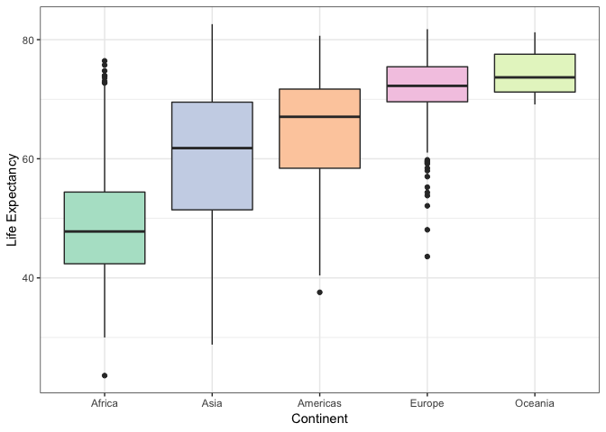
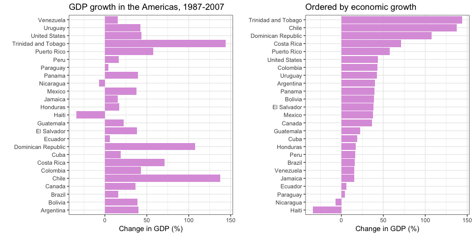

hw05\_factor\_figure\_mgmt
================
Alejandra
17/10/2018

## Factor and figure management

This is an R Markdown document elaborated to serve as a personal
cheatsheet on the topic of factor and figure management. For the
exercises contained in this assignment, I chose to work with the
`gapminder` dataset.

## Loading data and required libraries

``` r
library(gapminder)
library(tidyverse)
library(plotly)
library(knitr)
library(kableExtra)
library(gridExtra)
```

## Part 1: Factor management

*Factor inspection*

First, let’s ensure the variables that I’ll explore are factors. This
can be done by looking at the class of the variables.

``` r
# showing str() output as a table
data.frame(variable = names(gapminder),
           class = sapply(gapminder, class),
           levels = sapply(gapminder, nlevels),
           first_values = sapply(gapminder, function(x) paste0(head(x),  collapse = ", ")),
           row.names = NULL) %>%
  kable() %>%
  kable_styling(full_width = F, position = "center")
```

<table class="table" style="width: auto !important; margin-left: auto; margin-right: auto;">

<thead>

<tr>

<th style="text-align:left;">

variable

</th>

<th style="text-align:left;">

class

</th>

<th style="text-align:right;">

levels

</th>

<th style="text-align:left;">

first\_values

</th>

</tr>

</thead>

<tbody>

<tr>

<td style="text-align:left;">

country

</td>

<td style="text-align:left;">

factor

</td>

<td style="text-align:right;">

142

</td>

<td style="text-align:left;">

Afghanistan, Afghanistan, Afghanistan, Afghanistan, Afghanistan,
Afghanistan

</td>

</tr>

<tr>

<td style="text-align:left;">

continent

</td>

<td style="text-align:left;">

factor

</td>

<td style="text-align:right;">

5

</td>

<td style="text-align:left;">

Asia, Asia, Asia, Asia, Asia, Asia

</td>

</tr>

<tr>

<td style="text-align:left;">

year

</td>

<td style="text-align:left;">

integer

</td>

<td style="text-align:right;">

0

</td>

<td style="text-align:left;">

1952, 1957, 1962, 1967, 1972, 1977

</td>

</tr>

<tr>

<td style="text-align:left;">

lifeExp

</td>

<td style="text-align:left;">

numeric

</td>

<td style="text-align:right;">

0

</td>

<td style="text-align:left;">

28.801, 30.332, 31.997, 34.02, 36.088, 38.438

</td>

</tr>

<tr>

<td style="text-align:left;">

pop

</td>

<td style="text-align:left;">

integer

</td>

<td style="text-align:right;">

0

</td>

<td style="text-align:left;">

8425333, 9240934, 10267083, 11537966, 13079460, 14880372

</td>

</tr>

<tr>

<td style="text-align:left;">

gdpPercap

</td>

<td style="text-align:left;">

numeric

</td>

<td style="text-align:right;">

0

</td>

<td style="text-align:left;">

779.4453145, 820.8530296, 853.10071, 836.1971382, 739.9811058, 786.11336

</td>

</tr>

</tbody>

</table>

In the table above we can see the classes of all variables. The
variables `country` and `continent` are indeed factors, `country` has
142 levels and `continent` has 5 levels.

**Explore the effects of `arrange()`**

Does merely arranging the data have any effect on a figure?

Here, I’ll explore what happens to a figure after sorting the data with
the `arrange()` function. I’ll order the `continent` variable according
to the minimum value of life expectancy.

First let’s check that `arrange()` works:

``` r
#new dataset with continent and minimum lifeExp
gap_minlifeExp <- gapminder %>% 
  group_by(continent) %>%
  summarize(minlife = min(lifeExp)) %>%
  arrange(minlife)

kable(gap_minlifeExp) %>%
  kable_styling(full_width = F)
```

<table class="table" style="width: auto !important; margin-left: auto; margin-right: auto;">

<thead>

<tr>

<th style="text-align:left;">

continent

</th>

<th style="text-align:right;">

minlife

</th>

</tr>

</thead>

<tbody>

<tr>

<td style="text-align:left;">

Africa

</td>

<td style="text-align:right;">

23.599

</td>

</tr>

<tr>

<td style="text-align:left;">

Asia

</td>

<td style="text-align:right;">

28.801

</td>

</tr>

<tr>

<td style="text-align:left;">

Americas

</td>

<td style="text-align:right;">

37.579

</td>

</tr>

<tr>

<td style="text-align:left;">

Europe

</td>

<td style="text-align:right;">

43.585

</td>

</tr>

<tr>

<td style="text-align:left;">

Oceania

</td>

<td style="text-align:right;">

69.120

</td>

</tr>

</tbody>

</table>

We can see that the data in the table was indeed arranged by the minimum
value of life expectancy in each continent in ascending order.

Now let’s try arranging the data in a figure. For the purposes of
plotting, I will join the dataset `gap_minlifeExp` created above with
the `gapminder` dataset and arrange the data using `minlife` as
before.

``` r
gap_new <- left_join(gapminder, gap_minlifeExp, by = "continent") #join datasets to create a boxplot


gap_new %>% 
  arrange(minlife) %>% 
  ggplot(aes(x = continent, y = lifeExp, fill = continent)) +
  scale_fill_brewer(palette = "Pastel2") + #change color palette
  guides(fill=FALSE) + #remove unnecessary color legend
  geom_boxplot() +
  theme_bw() #select theme
```

<!-- -->

As we can see, in the figure the data wasn’t arranged as it was in the
output table, instead, continents are sorted alphabetically.

**Explore the effects of reordering a factor**

What effect does this have on a figure?

Here I will try to sort the data of the same figure but using
`reorder()` instead.

``` r
gap_new %>%
  ggplot(aes(x = reorder(continent, minlife), y = lifeExp, fill = continent)) +
  scale_fill_brewer(palette = "Pastel2") + #change color palette
  guides(fill=FALSE) + #remove unnecessary color legend
  geom_boxplot() +
  theme_bw() #select theme
```

<!-- -->

As the `reorder()` function does reorders the levels of the factor, the
continents in the figure are now ordered as desired (by minimum life
expectancy).

### Drop Oceania

In this section, I’ll flter the `gpminder` data to remove observations
associated with the continent of Oceania. Additionally, remove unused
factor levels. Provide concrete information on the data before and after
removing these rows and Oceania; address the number of rows and the
levels of the affected factors.

``` r
gap_no_oceania <- gapminder %>%
  filter(continent != "Oceania")

str(gap_no_oceania)
```

    ## Classes 'tbl_df', 'tbl' and 'data.frame':    1680 obs. of  6 variables:
    ##  $ country  : Factor w/ 142 levels "Afghanistan",..: 1 1 1 1 1 1 1 1 1 1 ...
    ##  $ continent: Factor w/ 5 levels "Africa","Americas",..: 3 3 3 3 3 3 3 3 3 3 ...
    ##  $ year     : int  1952 1957 1962 1967 1972 1977 1982 1987 1992 1997 ...
    ##  $ lifeExp  : num  28.8 30.3 32 34 36.1 ...
    ##  $ pop      : int  8425333 9240934 10267083 11537966 13079460 14880372 12881816 13867957 16317921 22227415 ...
    ##  $ gdpPercap: num  779 821 853 836 740 ...

Looking at the structure, we can see that the number of observations in
`gap_no_oceania` is different from the original `gapminder` dataset:
1680 vs. 1704 respectiveley, however the number of levels in both
`country` and `continent` is still the same.

Let’s look at the unique values in `gap_no_oceania`

``` r
summary(gap_no_oceania$continent)
```

    ##   Africa Americas     Asia   Europe  Oceania 
    ##      624      300      396      360        0

We can see that the observations from Oceania were removed but is still
in the factor levels.

Let’s remove Oceania from the levels:

``` r
gap_no_oceania <- droplevels(gap_no_oceania)
nlevels(gap_no_oceania$continent) #check the number of levels
```

    ## [1] 4

``` r
summary(gap_no_oceania$continent) #check which are the remaining levels 
```

    ##   Africa Americas     Asia   Europe 
    ##      624      300      396      360

As noted, we are now left with 4 levels. The Oceania level was removed
by using `droplevels()`, this function drops unused levels from a
factor, since Oceania didn’t have observations anymore it was dropped.

### Reorder the levels of `continent`

Here, I will use the forcats package to change the order of the factor
levels, based on the maxmimum value of gdp per capita. I’m interested in
looking at the growth in gdp in countries from the Americas from the
last 20 years of data (1987-2007)

First let’s calculate the growth in this period:

``` r
gap_gdp <- gapminder %>%
  filter(continent == "Americas", year %in% c(1987, 2007)) %>%
  select(country, year, gdpPercap) %>%
  spread(key = year, value = gdpPercap) %>%
  mutate(growth = `2007` - `1987`) %>%
  arrange(growth)

kable(gap_gdp) %>%
  kable_styling(full_width = F)
```

<table class="table" style="width: auto !important; margin-left: auto; margin-right: auto;">

<thead>

<tr>

<th style="text-align:left;">

country

</th>

<th style="text-align:right;">

1987

</th>

<th style="text-align:right;">

2007

</th>

<th style="text-align:right;">

growth

</th>

</tr>

</thead>

<tbody>

<tr>

<td style="text-align:left;">

Haiti

</td>

<td style="text-align:right;">

1823.016

</td>

<td style="text-align:right;">

1201.637

</td>

<td style="text-align:right;">

\-621.3788

</td>

</tr>

<tr>

<td style="text-align:left;">

Nicaragua

</td>

<td style="text-align:right;">

2955.984

</td>

<td style="text-align:right;">

2749.321

</td>

<td style="text-align:right;">

\-206.6634

</td>

</tr>

<tr>

<td style="text-align:left;">

Paraguay

</td>

<td style="text-align:right;">

3998.876

</td>

<td style="text-align:right;">

4172.838

</td>

<td style="text-align:right;">

173.9628

</td>

</tr>

<tr>

<td style="text-align:left;">

Ecuador

</td>

<td style="text-align:right;">

6481.777

</td>

<td style="text-align:right;">

6873.262

</td>

<td style="text-align:right;">

391.4853

</td>

</tr>

<tr>

<td style="text-align:left;">

Honduras

</td>

<td style="text-align:right;">

3023.097

</td>

<td style="text-align:right;">

3548.331

</td>

<td style="text-align:right;">

525.2341

</td>

</tr>

<tr>

<td style="text-align:left;">

Guatemala

</td>

<td style="text-align:right;">

4246.486

</td>

<td style="text-align:right;">

5186.050

</td>

<td style="text-align:right;">

939.5640

</td>

</tr>

<tr>

<td style="text-align:left;">

Jamaica

</td>

<td style="text-align:right;">

6351.237

</td>

<td style="text-align:right;">

7320.880

</td>

<td style="text-align:right;">

969.6428

</td>

</tr>

<tr>

<td style="text-align:left;">

Peru

</td>

<td style="text-align:right;">

6360.943

</td>

<td style="text-align:right;">

7408.906

</td>

<td style="text-align:right;">

1047.9621

</td>

</tr>

<tr>

<td style="text-align:left;">

Bolivia

</td>

<td style="text-align:right;">

2753.691

</td>

<td style="text-align:right;">

3822.137

</td>

<td style="text-align:right;">

1068.4456

</td>

</tr>

<tr>

<td style="text-align:left;">

Brazil

</td>

<td style="text-align:right;">

7807.096

</td>

<td style="text-align:right;">

9065.801

</td>

<td style="text-align:right;">

1258.7050

</td>

</tr>

<tr>

<td style="text-align:left;">

Cuba

</td>

<td style="text-align:right;">

7532.925

</td>

<td style="text-align:right;">

8948.103

</td>

<td style="text-align:right;">

1415.1782

</td>

</tr>

<tr>

<td style="text-align:left;">

Venezuela

</td>

<td style="text-align:right;">

9883.585

</td>

<td style="text-align:right;">

11415.806

</td>

<td style="text-align:right;">

1532.2210

</td>

</tr>

<tr>

<td style="text-align:left;">

El Salvador

</td>

<td style="text-align:right;">

4140.442

</td>

<td style="text-align:right;">

5728.354

</td>

<td style="text-align:right;">

1587.9114

</td>

</tr>

<tr>

<td style="text-align:left;">

Colombia

</td>

<td style="text-align:right;">

4903.219

</td>

<td style="text-align:right;">

7006.580

</td>

<td style="text-align:right;">

2103.3613

</td>

</tr>

<tr>

<td style="text-align:left;">

Panama

</td>

<td style="text-align:right;">

7034.779

</td>

<td style="text-align:right;">

9809.186

</td>

<td style="text-align:right;">

2774.4065

</td>

</tr>

<tr>

<td style="text-align:left;">

Dominican Republic

</td>

<td style="text-align:right;">

2899.842

</td>

<td style="text-align:right;">

6025.375

</td>

<td style="text-align:right;">

3125.5326

</td>

</tr>

<tr>

<td style="text-align:left;">

Uruguay

</td>

<td style="text-align:right;">

7452.399

</td>

<td style="text-align:right;">

10611.463

</td>

<td style="text-align:right;">

3159.0640

</td>

</tr>

<tr>

<td style="text-align:left;">

Mexico

</td>

<td style="text-align:right;">

8688.156

</td>

<td style="text-align:right;">

11977.575

</td>

<td style="text-align:right;">

3289.4190

</td>

</tr>

<tr>

<td style="text-align:left;">

Argentina

</td>

<td style="text-align:right;">

9139.671

</td>

<td style="text-align:right;">

12779.380

</td>

<td style="text-align:right;">

3639.7083

</td>

</tr>

<tr>

<td style="text-align:left;">

Costa Rica

</td>

<td style="text-align:right;">

5629.915

</td>

<td style="text-align:right;">

9645.061

</td>

<td style="text-align:right;">

4015.1461

</td>

</tr>

<tr>

<td style="text-align:left;">

Puerto Rico

</td>

<td style="text-align:right;">

12281.342

</td>

<td style="text-align:right;">

19328.709

</td>

<td style="text-align:right;">

7047.3671

</td>

</tr>

<tr>

<td style="text-align:left;">

Chile

</td>

<td style="text-align:right;">

5547.064

</td>

<td style="text-align:right;">

13171.639

</td>

<td style="text-align:right;">

7624.5751

</td>

</tr>

<tr>

<td style="text-align:left;">

Canada

</td>

<td style="text-align:right;">

26626.515

</td>

<td style="text-align:right;">

36319.235

</td>

<td style="text-align:right;">

9692.7200

</td>

</tr>

<tr>

<td style="text-align:left;">

Trinidad and Tobago

</td>

<td style="text-align:right;">

7388.598

</td>

<td style="text-align:right;">

18008.509

</td>

<td style="text-align:right;">

10619.9114

</td>

</tr>

<tr>

<td style="text-align:left;">

United States

</td>

<td style="text-align:right;">

29884.350

</td>

<td style="text-align:right;">

42951.653

</td>

<td style="text-align:right;">

13067.3027

</td>

</tr>

</tbody>

</table>

As we can see, the continents were arranged by the growth in GDP, but
let’s remember that it doesn’t change the order of levels. I will use
`fct_reorder` to make my plot look nicer and compare with ploting
without reordering.

``` r
p1 <- ggplot(gap_gdp, aes(x = growth, y = country)) +
  geom_point() +
  theme_bw()
p2 <- ggplot(gap_gdp, aes(x = growth, y = fct_reorder(country, growth))) +
  geom_point()+
  theme_bw()
  
grid.arrange(p1, p2, nrow = 1, ncol= 2)
```

<!-- -->

``` r
#gap_sd_reordered <- fct_reorder(gap_sd$continent,
 #                               gap_sd$life_sd)
#levels(gap_sd_reordered)
```

### Part 2: File I/O

#### `write_csv()`

First, I’ll check again that levels are saved
